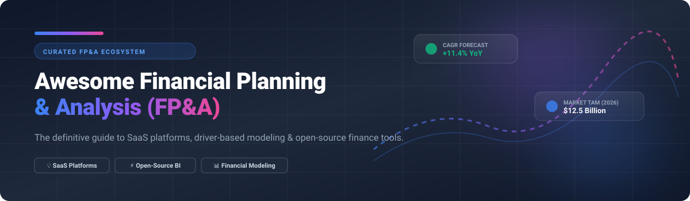

  

# 📊 Awesome Financial Planning & Analysis (FP&A) 🚀

> 💡 **The definitive curated list of top Financial Planning & Analysis (FP&A) SaaS software, open-source budgeting engines, driver-based financial modeling frameworks, and CFO reporting tools.**

---

## 📈 Market Size & Industry Dynamics

> 💡 **Market Size & Overview**: The global Financial Planning & Analysis (FP&A) software market is estimated at **$12.5 Billion in 2026** (projected to reach ~$16.8 Billion by 2030 at a CAGR of ~11.4%).
> 
> 🧩 **Market Fragmentation & Competitive Structure**: The market is **moderately fragmented**. While legacy software monoliths (Workday Adaptive, Anaplan, SAP BPC) control enterprise market share, mid-market and SMB segments are highly contested by high-growth SaaS platforms (Pigment, Datarails, Cube, Vena). Open-source options serve as semantic layers and analytics foundations rather than standalone end-to-end FP&A engines.

---

## 📌 Table of Contents

- [🏢 SaaS & Commercial FP&A Platforms](#-saas--commercial-fpa-platforms)
- [💻 Open-Source FP&A & Analytics Projects](#-open-source-fpa--analytics-projects)
- [🤝 How to Contribute](#-how-to-contribute)
- [⚠️ Disclaimer](#%EF%B8%8F-disclaimer)

---

## 🏢 SaaS & Commercial FP&A Platforms

Below is a comparative breakdown of commercial FP&A platforms sorted by company size (valuation / revenue / enterprise scale in descending order):

| Product Name | Company Size / Scale (Valuation / Revenue) 📊 | Description 📝 | Starting Pricing 💵 | Free Tier / Trial Limits ⏳ |
| --- | --- | --- | --- | --- |
| **[Workday Adaptive Planning](https://www.workday.com/)** 🏢 | **~$60 Billion** (Parent Workday Mkt Cap; ~$600M+ Adaptive ARR) | Enterprise connected-planning software for financial budgeting, rolling forecasts, workforce planning, and operational modeling. | Custom quote (typically \$15,000–\$50,000+/year base) | 30-day free trial with core planning feature walkthroughs |
| **[Anaplan](https://www.anaplan.com/)** 🏢 | **~$10.7 Billion** (Acquired by Thoma Bravo; ~$600M+ ARR) | Enterprise connected-planning platform known for large-scale, multi-dimensional modeling across finance, sales, and supply chain. | Starts at \$30,000/year (estimated baseline quote) | No commercial free trial (90-day educational workspace via Talent Builder) |
| **[Pigment](https://www.gopigment.com/)** 🦄 | **~$1.0 Billion** (Series D valuation; \$50M+ ARR) | Modern multi-dimensional business planning and scenario modeling platform designed for high-growth enterprises. | Starts at \$50,000+/year custom enterprise tier | 14-day free trial with AI model builder & workspace upload limits |
| **[Prophix](https://www.prophix.com/)** 🏢 | **~$800 Million** (PE valuation estimate; \$100M+ ARR) | Corporate performance management (CPM) and financial consolidation suite for mid-market finance teams. | Starts at \$50,000/year base tier | No free trial (self-guided interactive demo library available) |
| **[Planful](https://planful.com/)** 🏢 | **~$500 Million** (Vector Capital backed; \$80M+ ARR) | Continuous planning platform covering budgeting, forecasting, financial consolidation, and executive reporting. | Custom quote (typically \$30,000–\$100,000+/year base) | No self-service free trial (time-bound Proof of Concept available) |
| **[Vena Solutions](https://www.venasolutions.com/)** 🏢 | **~$450 Million** (Growth equity valuation; \$60M+ ARR) | Excel-native financial planning and performance management platform connecting native Excel to a centralized database. | Starts at \$5,000–\$10,000/year baseline quote | No free trial (interactive demo available) |
| **[Datarails](https://www.datarails.com/)** 🚀 | **~$400 Million** (Series B valuation; \$30M+ ARR) | FP&A platform that keeps Excel at the center while adding cloud automation, consolidation, and data governance. | Starts at \$24,000/year | No free trial (guided demo & custom consultation available) |
| **[Cube](https://www.cubesoftware.com/)** 🚀 | **~$150 Million** (Series B valuation; \$15M+ ARR) | Spreadsheet-native FP&A platform that connects Excel and Google Sheets to a governed multi-dimensional data layer. | Starts at \$1,250/month (\$15,000/year) | No free trial or free-forever tier (interactive demo on request) |
| **[Mosaic](https://www.mosaic.tech/)** 🚀 | **~$150 Million** (Series B valuation; \$15M+ ARR) | Strategic finance platform combining automated planning, real-time analytics, and financial benchmarking. | Starts at \$2,000/month (estimated £2,000–£5,000/mo) | No self-service free trial (guided demo provided) |
| **[Abacum](https://www.abacum.ai/)** 🚀 | **~$100 Million** (Series A valuation; \$10M+ ARR) | Collaborative FP&A platform focused on agile forecasting and cross-functional alignment for growth-stage tech companies. | Custom quote based on user count & modules | No free trial or free tier (personalized live demo available) |
| **[Jirav](https://www.jirav.com/)** 🚀 | **~$60 Million** (Series B valuation; \$8M+ ARR) | Cloud FP&A software for driver-based budgeting, forecasting, and dashboards aimed at SMB and accounting firms. | Starts at \$10,000/year (Direct) / \$50/mo per client (Partner) | No free trial (guided pilot on custom data available upon request) |
| **[Centage](https://www.centage.com/)** 🏢 | **~$50 Million** (Private equity backed; \$10M+ ARR) | Automated budgeting and forecasting software focused on mid-market organizations seeking structured financial modeling. | Starts at \$699/month (\$18,000–\$40,000 annual avg) | No free trial (demo-based consultation approach) |
| **[SolveXia](https://www.solvexia.com/)** ⚙️ | **~$20 Million** (Mid-market automation provider) | Process automation, data reconciliation, and financial report automation platform for operations and finance teams. | Custom quote based on user resources (no setup fees) | No free trial (free downloadable Excel templates on site) |

---

## 💻 Open-Source FP&A & Analytics Projects

Top open-source projects, semantic layers, business intelligence platforms, and financial modeling libraries used in modern open FP&A tech stacks, **sorted by GitHub Star count (descending)**:

| Rank 🏆 | Project Name 🛠️ | GitHub Star Count ⭐ | Description 📝 |
| :---: | --- | :---: | --- |
| 1 | **[Apache Superset](https://github.com/apache/superset)** |  | Enterprise-ready open-source data exploration and visualization platform widely paired with data warehouses for FP&A reporting. |
| 2 | **[Metabase](https://github.com/metabase/metabase)** |  | Intuitive open-source business intelligence tool used by finance and operations teams for self-serve analysis and lightweight forecasting. |
| 3 | **[dbt-core](https://github.com/dbt-labs/dbt-core)** |  | Open-source data transformation layer (SQL/Python) for modeling actuals, variance analysis, and preparing financial metrics in data warehouses. |
| 4 | **[Cube (Semantic Layer)](https://github.com/cube-js/cube)** |  | Universal open-source semantic and metrics layer that standardizes KPIs, financial definitions, and security rules across planning workflows. |
| 5 | **[Actual Budget](https://github.com/actualbudget/actual-server)** |  | Super-fast, privacy-focused open-source local/self-hosted budgeting engine with zero-based budgeting principles. |
| 6 | **[Firefly III](https://github.com/firefly-iii/firefly-iii)** |  | Full-featured self-hosted manager for tracking budgets, recurring cash flows, and expense forecasting. |
| 7 | **[FinancePy](https://github.com/financepy/financepy)** |  | Python open-source financial library for valuation, cash flow modeling, driver analysis, and quantitative financial planning. |
| 8 | **[PyPika](https://github.com/kayak/pypika)** |  | Python SQL query builder used for programmatic query generation in custom financial modeling and scenario planning engines. |
| 9 | **[FinQuant](https://github.com/pypa/finquant)** |  | Open-source Python library for financial portfolio management, risk analysis, and scenario optimization. |
| 10 | **[Open-Sourced Financial Modeling Notebooks](https://github.com/topics/financial-modeling)** |  | Community-driven Jupyter notebooks and R scripts for 3-statement modeling, DCF valuations, and Monte Carlo forecasts. |

---

### 💡 Open-Source FP&A Architecture Patterns

For technical finance teams looking to build an **open FP&A stack**:
1. 🗄️ **Data Warehouse / Database**: Store actuals in PostgreSQL, DuckDB, or Snowflake.
2. 🔄 **Transformation & Metrics**: Use `dbt-core` and `Cube` to govern KPI metrics (ARR, CAC, LTV, Gross Margin).
3. 📊 **Visualization & Dashboards**: Connect `Apache Superset` or `Metabase` for executive reporting.
4. 🐍 **Driver-Based Modeling**: Run Python financial models (`FinancePy`, `pandas`) versioned in Git.

---

## 🤝 How to Contribute

Contributions are welcome! Help us keep this FP&A resource complete and up to date. 🚀

1. 🍴 **Fork** this repository.
2. 📝 **Add/edit** entries in `README.md` maintaining table formatting.
3. 🔗 Include product name, live link, concise description, starting pricing, and star badge (if open-source).
4. 📬 **Open a Pull Request** with a detailed summary.

---

## 💖 Support & Buy Me a Coffee

Thank you for exploring this FP&A resources directory! If you find this list helpful for your finance team, organization, or open-source projects, please consider supporting the project:

- ⭐ **Star** this repository to help others discover it!
- 🍴 **Fork** it to customize or contribute back improvements.
- 📢 **Share** it with fellow CFOs, FP&A analysts, and finance engineers!
- ☕ **Buy me a coffee / Sponsor**: Support ongoing maintenance via [GitHub Sponsors](https://github.com/sponsors/ishandutta2007).

---

## 📈 Star History

---

  <b>Made with ❤️ for FP&A Leaders, CFOs, Finance Engineers, and Open-Source Technologists.</b>

